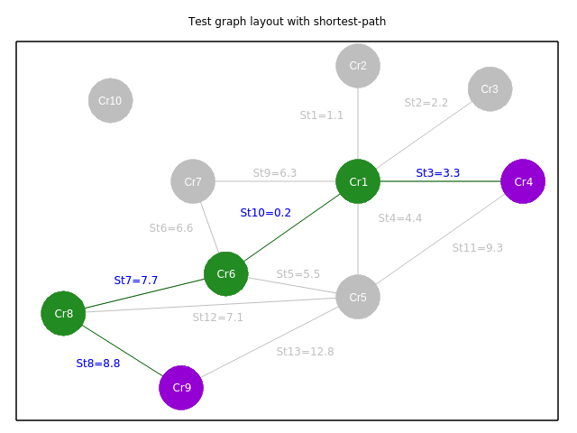
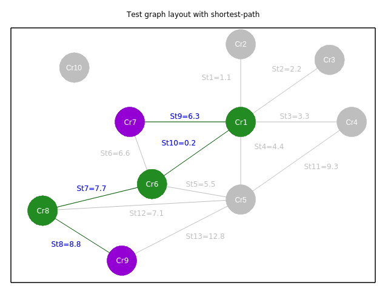

[comment]: <> (Link to documentation sections inside this file won't work in local-file, but only in doxygen html main page containing the readme - extra html commands under images for doxygen)

<h1><b>Graphs and Dijkstra's algorithm C code with gnuplot graphics</b></h1>

<h2><b>Main project contents:</b></h2>

---

<h3><b>Main makefile commands</b> (<i>for more detailed info, see <b><a href="page3.html">'Makefile'</a></b> section inside doxygen <b>'Related pages'</b></i>)</h3>

<i>Note: In order to correctly execute makefile's commands, the user must be inside 'Project/sw/' folder (same folder of the makefile).</i>

* <b>Compile commands:</b>
  * <b>make:</b> command to compile and link the whole project to executable (shortcut command of the following one).
  * <b>make all:</b> same command as above, full-name command.
  * <b>make run:</b> command to launch test-software executable.
  * <b>make all_run:</b> command to compile/link the whole project to test-software executable and to run it.
* <b>Doxygen commands:</b>
  * <b>make docs:</b> command to open browser in order to display doxygen html documentation.
* <b>Abstract commands:</b>
  * <b>make abstract:</b> command to open and view LaTeX exported pdf file through the predefined pdf-viewer software.

---

<h3><b>Doxygen html documentation</b> - <i>to open doxygen html documentation, see <b>'make docs'</b> makefile command (browser required)</i></h3>

Html documentation of the software containing: files, functions, enums, data-types descriptions and so on.

---

<h3><b>Abstract</b> - <i>to open pdf abstract, see <b>'make abstract'</b> makefile command (a pdf viewer is required)</i></h3>

Introduction and brief description of the software, particularly about Dijkstra's algorithm theoretical aspects and implementation.

---

<h3><b>Main</b> (<i>for more detailed info, see <b><a href="page2.html">'Testing software'</a></b> section inside doxygen <b>'Related pages'</b></i>)</h3>

<b>Graph test:</b> main test software to create a small graph allocated inside heap and test Dijkstra's algorithm, to find minimum cost path. More in details, test main program allows to run two different typed of test on graph-library and Dijkstra's algorithm (#dijkstra_alg() function inside lib_graph.c):
* <b>Predefined test:</b> test from a pre-defined source node towards a pre-defined destination node (designated by #SOURCE_NODE_NAME and #DESTINATION_NODE_NAME macros).
* <b>Personalized test:</b> test from a user-defined source node towards a user-defined destination node (designated by user terminal-inputs during test execution).

---

<h3><b>Libraries</b></h3>

* <b>Graph:</b> library for low-level graphs data management and for finding minimum cost path with Dijkstra's algorithm (<i>for more detailed info, see <b><a href="page5.html">'Graph library'</a></b> section inside doxygen <b>'Related pages'</b></i> - files lib_graph.h and lib_graph.c).
* <b>UI:</b> User-interface (terminal I/O) library to safetly manage terminal-inputs, print logo and coloured terminal-output feedbacks (<i>for more detailed info, see <b><a href="page6.html">'UI library'</a></b> section inside doxygen <b>'Related pages'</b></i> - files lib_ui.h and lib_ui.c).
* <b>Files:</b> library to manage files through open/close and read/write operations. (<i>for more detailed info, see <b><a href="page7.html">'Files library'</a></b> section inside doxygen <b>'Related pages'</b></i> - files lib_files.h and lib_files.c).
* <b>Timer:</b> library to manage time operations like delays (<i>for more detailed info, see <b><a href="page8.html">'Timer library'</a></b> section inside doxygen <b>'Related pages'</b></i> - files lib_timer.h and lib_timer.c).

---

<h3><b>Gnuplot</b> (<i>for more detailed info, see <b><a href="page4.html">'Gnuplot'</a></b> section inside doxygen <b>'Related pages'</b></i>)</h3>

In this software, gnuplot has the main purpose of plotting graph and shortest-path data. In order to that, inside main program (graph_test.c), two gnuplot scripts will be called to load and plot manipulated data inside .dat files. The former is called immediately after the testing option choice, while the latter is called once shortest-path has been displayed and descried on terminal.

* <b>Graph plotting script:</b> this file (graph_plot.cmd) is called from main testing software through a system command, with the aim of graphically showing the allocated graph structure to the user. Gnuplot's script, will then print data manually inserted by the user inside graph-plotting data files: archs.dat, costs.dat and nodes.dat.

\image html test_graph.png --> Test-graph layout exported from gnuplot.

* <b>Shortest path plotting script:</b> this other file (shortest_plot.cmd), is also called from main testing software through a system command, with the aim of graphically showing the allocated graph structure and detected min-cost path to the user. Gnuplot's script will then print data manually inserted by the user, inside graph-plotting data files: archs.dat, costs.dat and nodes.dat (light-gray colored). In addition, print data manipulated by test software (data from shortest_archs.dat, shortest_costs.dat, shortest_nodes.dat and src_dest_nodes.dat files), using colors to highlight shortest path from specified source node to specified destination node.

\image html shortest_path.png --> Test-graph layout with predefined shortest path exported from gnuplot.

\image html personalized_shortest_path.png --> Test-graph layout with personalized shortest path exported from gnuplot.

---

<h2><b>Project folders structure:</b></h2>

&nbsp;. 
├── README.md 
├── doc 
│&nbsp;&nbsp;&nbsp;&nbsp;&nbsp;&nbsp;├── abstract 
│&nbsp;&nbsp;&nbsp;&nbsp;&nbsp;&nbsp;│&nbsp;&nbsp;&nbsp;&nbsp;&nbsp;&nbsp;├── biblio 
│&nbsp;&nbsp;&nbsp;&nbsp;&nbsp;&nbsp;│&nbsp;&nbsp;&nbsp;&nbsp;&nbsp;&nbsp;│&nbsp;&nbsp;&nbsp;&nbsp;&nbsp;&nbsp;└── references.bib 
│&nbsp;&nbsp;&nbsp;&nbsp;&nbsp;&nbsp;│&nbsp;&nbsp;&nbsp;&nbsp;&nbsp;&nbsp;├── imgs 
│&nbsp;&nbsp;&nbsp;&nbsp;&nbsp;&nbsp;│&nbsp;&nbsp;&nbsp;&nbsp;&nbsp;&nbsp;│&nbsp;&nbsp;&nbsp;&nbsp;&nbsp;&nbsp;└── graph.png 
│&nbsp;&nbsp;&nbsp;&nbsp;&nbsp;&nbsp;│&nbsp;&nbsp;&nbsp;&nbsp;&nbsp;&nbsp;├── relazione-finale-CRISTIAN-MERLI.aux 
│&nbsp;&nbsp;&nbsp;&nbsp;&nbsp;&nbsp;│&nbsp;&nbsp;&nbsp;&nbsp;&nbsp;&nbsp;├── relazione-finale-CRISTIAN-MERLI.bbl 
│&nbsp;&nbsp;&nbsp;&nbsp;&nbsp;&nbsp;│&nbsp;&nbsp;&nbsp;&nbsp;&nbsp;&nbsp;├── relazione-finale-CRISTIAN-MERLI.blg 
│&nbsp;&nbsp;&nbsp;&nbsp;&nbsp;&nbsp;│&nbsp;&nbsp;&nbsp;&nbsp;&nbsp;&nbsp;├── relazione-finale-CRISTIAN-MERLI.fdb_latexmk 
│&nbsp;&nbsp;&nbsp;&nbsp;&nbsp;&nbsp;│&nbsp;&nbsp;&nbsp;&nbsp;&nbsp;&nbsp;├── relazione-finale-CRISTIAN-MERLI.fls 
│&nbsp;&nbsp;&nbsp;&nbsp;&nbsp;&nbsp;│&nbsp;&nbsp;&nbsp;&nbsp;&nbsp;&nbsp;├── relazione-finale-CRISTIAN-MERLI.log 
│&nbsp;&nbsp;&nbsp;&nbsp;&nbsp;&nbsp;│&nbsp;&nbsp;&nbsp;&nbsp;&nbsp;&nbsp;├── relazione-finale-CRISTIAN-MERLI.out 
│&nbsp;&nbsp;&nbsp;&nbsp;&nbsp;&nbsp;│&nbsp;&nbsp;&nbsp;&nbsp;&nbsp;&nbsp;├── <b>relazione-finale-CRISTIAN-MERLI.pdf</b> 
│&nbsp;&nbsp;&nbsp;&nbsp;&nbsp;&nbsp;│&nbsp;&nbsp;&nbsp;&nbsp;&nbsp;&nbsp;├── relazione-finale-CRISTIAN-MERLI.synctex.gz 
│&nbsp;&nbsp;&nbsp;&nbsp;&nbsp;&nbsp;│&nbsp;&nbsp;&nbsp;&nbsp;&nbsp;&nbsp;└── relazione-finale-CRISTIAN-MERLI.tex 
│&nbsp;&nbsp;&nbsp;&nbsp;&nbsp;&nbsp;│&nbsp;&nbsp;&nbsp;&nbsp;&nbsp;&nbsp;└── relazione-finale-CRISTIAN-MERLI.toc 
│&nbsp;&nbsp;&nbsp;&nbsp;&nbsp;&nbsp;│&nbsp;&nbsp;&nbsp;&nbsp;&nbsp;&nbsp;&nbsp;&nbsp;&nbsp;&nbsp;&nbsp;&nbsp;&nbsp;&nbsp;└── abstract.tex 
│&nbsp;&nbsp;&nbsp;&nbsp;&nbsp;&nbsp;└── doxygen 
│&nbsp;&nbsp;&nbsp;&nbsp;&nbsp;&nbsp;&nbsp;&nbsp;&nbsp;&nbsp;&nbsp;&nbsp;&nbsp;&nbsp;├── doxygen_config 
│&nbsp;&nbsp;&nbsp;&nbsp;&nbsp;&nbsp;&nbsp;&nbsp;&nbsp;&nbsp;&nbsp;&nbsp;&nbsp;&nbsp;├── exports 
│&nbsp;&nbsp;&nbsp;&nbsp;&nbsp;&nbsp;&nbsp;&nbsp;&nbsp;&nbsp;&nbsp;&nbsp;&nbsp;&nbsp;│&nbsp;&nbsp;&nbsp;&nbsp;&nbsp;&nbsp;├── <b>html</b> 
│&nbsp;&nbsp;&nbsp;&nbsp;&nbsp;&nbsp;&nbsp;&nbsp;&nbsp;&nbsp;&nbsp;&nbsp;&nbsp;&nbsp;│&nbsp;&nbsp;&nbsp;&nbsp;&nbsp;&nbsp;└── rtf 
│&nbsp;&nbsp;&nbsp;&nbsp;&nbsp;&nbsp;&nbsp;&nbsp;&nbsp;&nbsp;&nbsp;&nbsp;&nbsp;&nbsp;└── src 
└── sw 
&nbsp;&nbsp;&nbsp;&nbsp;&nbsp;&nbsp;&nbsp;&nbsp;├── gnuplot 
&nbsp;&nbsp;&nbsp;&nbsp;&nbsp;&nbsp;&nbsp;&nbsp;│&nbsp;&nbsp;&nbsp;&nbsp;&nbsp;&nbsp;├── archs.dat 
&nbsp;&nbsp;&nbsp;&nbsp;&nbsp;&nbsp;&nbsp;&nbsp;│&nbsp;&nbsp;&nbsp;&nbsp;&nbsp;&nbsp;├── costs.dat 
&nbsp;&nbsp;&nbsp;&nbsp;&nbsp;&nbsp;&nbsp;&nbsp;│&nbsp;&nbsp;&nbsp;&nbsp;&nbsp;&nbsp;├── exports 
&nbsp;&nbsp;&nbsp;&nbsp;&nbsp;&nbsp;&nbsp;&nbsp;│&nbsp;&nbsp;&nbsp;&nbsp;&nbsp;&nbsp;│&nbsp;&nbsp;&nbsp;&nbsp;&nbsp;&nbsp;├── imgs 
&nbsp;&nbsp;&nbsp;&nbsp;&nbsp;&nbsp;&nbsp;&nbsp;│&nbsp;&nbsp;&nbsp;&nbsp;&nbsp;&nbsp;│&nbsp;&nbsp;&nbsp;&nbsp;&nbsp;&nbsp;└── pdf 
&nbsp;&nbsp;&nbsp;&nbsp;&nbsp;&nbsp;&nbsp;&nbsp;│&nbsp;&nbsp;&nbsp;&nbsp;&nbsp;&nbsp;├── graph_plot.cmd 
&nbsp;&nbsp;&nbsp;&nbsp;&nbsp;&nbsp;&nbsp;&nbsp;│&nbsp;&nbsp;&nbsp;&nbsp;&nbsp;&nbsp;├── nodes.dat 
&nbsp;&nbsp;&nbsp;&nbsp;&nbsp;&nbsp;&nbsp;&nbsp;│&nbsp;&nbsp;&nbsp;&nbsp;&nbsp;&nbsp;├── shortest_archs.dat 
&nbsp;&nbsp;&nbsp;&nbsp;&nbsp;&nbsp;&nbsp;&nbsp;│&nbsp;&nbsp;&nbsp;&nbsp;&nbsp;&nbsp;├── shortest_costs.dat 
&nbsp;&nbsp;&nbsp;&nbsp;&nbsp;&nbsp;&nbsp;&nbsp;│&nbsp;&nbsp;&nbsp;&nbsp;&nbsp;&nbsp;├── shortest_nodes.dat 
&nbsp;&nbsp;&nbsp;&nbsp;&nbsp;&nbsp;&nbsp;&nbsp;│&nbsp;&nbsp;&nbsp;&nbsp;&nbsp;&nbsp;├── shortest_plot.cmd 
&nbsp;&nbsp;&nbsp;&nbsp;&nbsp;&nbsp;&nbsp;&nbsp;│&nbsp;&nbsp;&nbsp;&nbsp;&nbsp;&nbsp;└── src_dest_nodes.dat 
&nbsp;&nbsp;&nbsp;&nbsp;&nbsp;&nbsp;&nbsp;&nbsp;├── lib 
&nbsp;&nbsp;&nbsp;&nbsp;&nbsp;&nbsp;&nbsp;&nbsp;│&nbsp;&nbsp;&nbsp;&nbsp;&nbsp;&nbsp;├── files 
&nbsp;&nbsp;&nbsp;&nbsp;&nbsp;&nbsp;&nbsp;&nbsp;│&nbsp;&nbsp;&nbsp;&nbsp;&nbsp;&nbsp;│&nbsp;&nbsp;&nbsp;&nbsp;&nbsp;&nbsp;├── lib_files.c 
&nbsp;&nbsp;&nbsp;&nbsp;&nbsp;&nbsp;&nbsp;&nbsp;│&nbsp;&nbsp;&nbsp;&nbsp;&nbsp;&nbsp;│&nbsp;&nbsp;&nbsp;&nbsp;&nbsp;&nbsp;├── lib_files.h 
&nbsp;&nbsp;&nbsp;&nbsp;&nbsp;&nbsp;&nbsp;&nbsp;│&nbsp;&nbsp;&nbsp;&nbsp;&nbsp;&nbsp;│&nbsp;&nbsp;&nbsp;&nbsp;&nbsp;&nbsp;└── lib_files.so 
&nbsp;&nbsp;&nbsp;&nbsp;&nbsp;&nbsp;&nbsp;&nbsp;│&nbsp;&nbsp;&nbsp;&nbsp;&nbsp;&nbsp;├── graph 
&nbsp;&nbsp;&nbsp;&nbsp;&nbsp;&nbsp;&nbsp;&nbsp;│&nbsp;&nbsp;&nbsp;&nbsp;&nbsp;&nbsp;│&nbsp;&nbsp;&nbsp;&nbsp;&nbsp;&nbsp;├── lib_graph.c 
&nbsp;&nbsp;&nbsp;&nbsp;&nbsp;&nbsp;&nbsp;&nbsp;│&nbsp;&nbsp;&nbsp;&nbsp;&nbsp;&nbsp;│&nbsp;&nbsp;&nbsp;&nbsp;&nbsp;&nbsp;├── lib_graph.h 
&nbsp;&nbsp;&nbsp;&nbsp;&nbsp;&nbsp;&nbsp;&nbsp;│&nbsp;&nbsp;&nbsp;&nbsp;&nbsp;&nbsp;│&nbsp;&nbsp;&nbsp;&nbsp;&nbsp;&nbsp;└── lib_graph.so 
&nbsp;&nbsp;&nbsp;&nbsp;&nbsp;&nbsp;&nbsp;&nbsp;│&nbsp;&nbsp;&nbsp;&nbsp;&nbsp;&nbsp;├── timer 
&nbsp;&nbsp;&nbsp;&nbsp;&nbsp;&nbsp;&nbsp;&nbsp;│&nbsp;&nbsp;&nbsp;&nbsp;&nbsp;&nbsp;│&nbsp;&nbsp;&nbsp;&nbsp;&nbsp;&nbsp;├── lib_timer.c 
&nbsp;&nbsp;&nbsp;&nbsp;&nbsp;&nbsp;&nbsp;&nbsp;│&nbsp;&nbsp;&nbsp;&nbsp;&nbsp;&nbsp;│&nbsp;&nbsp;&nbsp;&nbsp;&nbsp;&nbsp;├── lib_timer.h 
&nbsp;&nbsp;&nbsp;&nbsp;&nbsp;&nbsp;&nbsp;&nbsp;│&nbsp;&nbsp;&nbsp;&nbsp;&nbsp;&nbsp;│&nbsp;&nbsp;&nbsp;&nbsp;&nbsp;&nbsp;└── lib_timer.so 
&nbsp;&nbsp;&nbsp;&nbsp;&nbsp;&nbsp;&nbsp;&nbsp;│&nbsp;&nbsp;&nbsp;&nbsp;&nbsp;&nbsp;└── ui 
&nbsp;&nbsp;&nbsp;&nbsp;&nbsp;&nbsp;&nbsp;&nbsp;│&nbsp;&nbsp;&nbsp;&nbsp;&nbsp;&nbsp;&nbsp;&nbsp;&nbsp;&nbsp;&nbsp;&nbsp;&nbsp;&nbsp;├── lib_ui.c 
&nbsp;&nbsp;&nbsp;&nbsp;&nbsp;&nbsp;&nbsp;&nbsp;│&nbsp;&nbsp;&nbsp;&nbsp;&nbsp;&nbsp;&nbsp;&nbsp;&nbsp;&nbsp;&nbsp;&nbsp;&nbsp;&nbsp;├── lib_ui.h 
&nbsp;&nbsp;&nbsp;&nbsp;&nbsp;&nbsp;&nbsp;&nbsp;│&nbsp;&nbsp;&nbsp;&nbsp;&nbsp;&nbsp;&nbsp;&nbsp;&nbsp;&nbsp;&nbsp;&nbsp;&nbsp;&nbsp;└── lib_ui.so 
&nbsp;&nbsp;&nbsp;&nbsp;&nbsp;&nbsp;&nbsp;&nbsp;├── main 
&nbsp;&nbsp;&nbsp;&nbsp;&nbsp;&nbsp;&nbsp;&nbsp;│&nbsp;&nbsp;&nbsp;&nbsp;&nbsp;&nbsp;├── graph_test.c 
&nbsp;&nbsp;&nbsp;&nbsp;&nbsp;&nbsp;&nbsp;&nbsp;│&nbsp;&nbsp;&nbsp;&nbsp;&nbsp;&nbsp;└── graph_test.o 
&nbsp;&nbsp;&nbsp;&nbsp;&nbsp;&nbsp;&nbsp;&nbsp;├── <b>graph_test</b> 
&nbsp;&nbsp;&nbsp;&nbsp;&nbsp;&nbsp;&nbsp;&nbsp;└── <b>makefile</b> 

<i>20 directories, 40 files</i>
